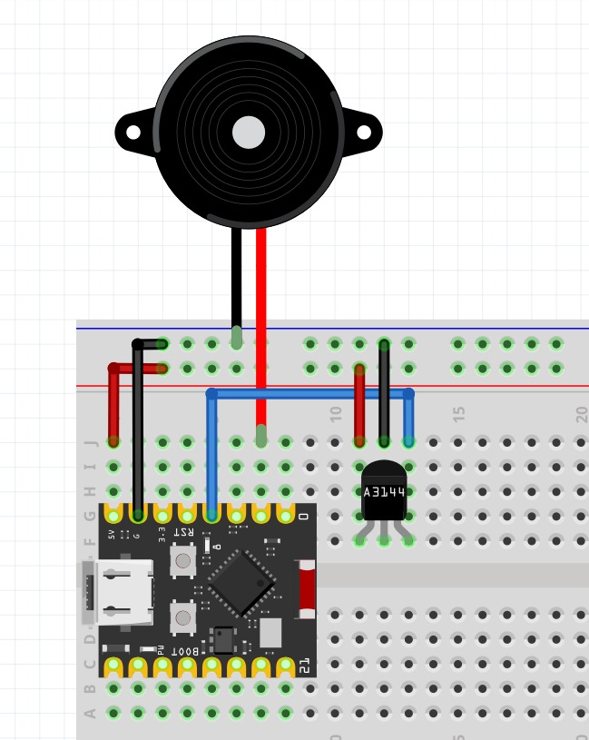
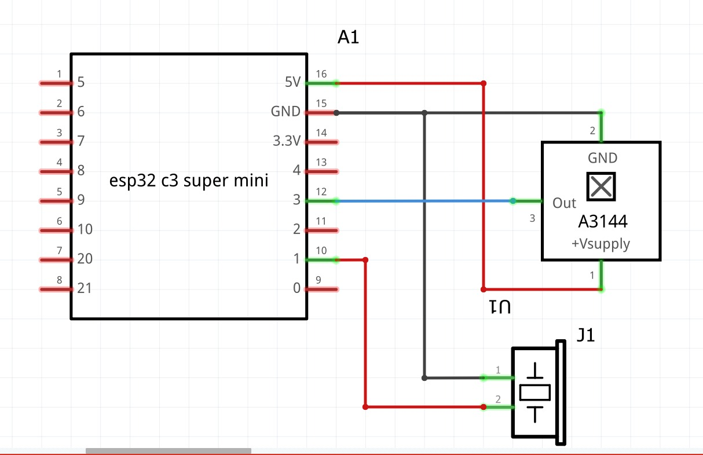

# In-Bag# 🚨 IN-BAG

**IN-BAG** es un dispositivo de seguridad basado en el microcontrolador **ESP32 S3** que ayuda a detectar la apertura de una mochila o bolso. Utiliza un sensor de efecto Hall A3144 para detectar imanes y emite una alarma sonora a través de un buzzer cuando se detecta un evento. Este dispositivo es ideal para aumentar la seguridad de tus pertenencias.

## 🔧 Componentes

Este proyecto utiliza los siguientes componentes:

| Componente                      | Descripción                      |
|---------------------------------|----------------------------------|
| 🛠️ Microcontrolador ESP32 S3   | Controlador principal            |
| 📡 Sensor de Efecto Hall A3144  | Detección de campos magnéticos   |
| 🔔 Buzzer                       | Emisión de sonido para alertas   |

## 📚 Librerías

El proyecto utiliza las siguientes librerías:

- `Arduino.h`

## 🚀 Funcionamiento

**IN-BAG** permite a los usuarios proteger sus pertenencias de la siguiente manera:

- **Detección de Apertura**: El sensor A3144 detecta cuando un imán se aleja, lo que indica que la mochila o bolso ha sido abierto.
- **Alerta Sonora**: Cuando se detecta la apertura, el buzzer emite un sonido para alertar al usuario.
- **Configuración Simple**: Se puede conectar fácilmente a una mochila o bolso y configurarse para activarse con imanes de contacto.

## 📋 Cómo Usar

1. **Conectar el dispositivo**: Asegúrate de que el ESP32 S3 esté alimentado y el sensor A3144 esté correctamente conectado al GPIO3.
2. **Colocar el Sensor**: Instala el sensor de efecto Hall en la parte de la mochila o bolso donde deseas detectar la apertura, asegurándote de que esté alineado con el imán.
3. **Prueba el Sistema**: Abre y cierra la mochila para verificar que el buzzer emita un sonido cuando el imán se aleja del sensor.

## 📍 Pinout del ESP32 S3

| Función          | Pin  | Descripción                           |
|------------------|------|---------------------------------------|
| **Buzzer**       | 1    | Activo al recibir una señal          |
| **Sensor A3144** | 3    | Salida de datos del sensor            |

## 📊 Imágenes del Proyecto

### Conexiones del ESP32 Super Mini

### Esquemático del Proyecto

## 🤝 Contribuciones

Si deseas contribuir a este proyecto, siéntete libre de hacer un fork y enviar pull requests.
Agradecimientos especiales a los siguientes colaboradores:
- **JonathanMM03** - Desarrollador principal, responsable de la implementación y mantenimiento del código.

## 📄 Licencia

Este proyecto está bajo la Licencia MIT.
